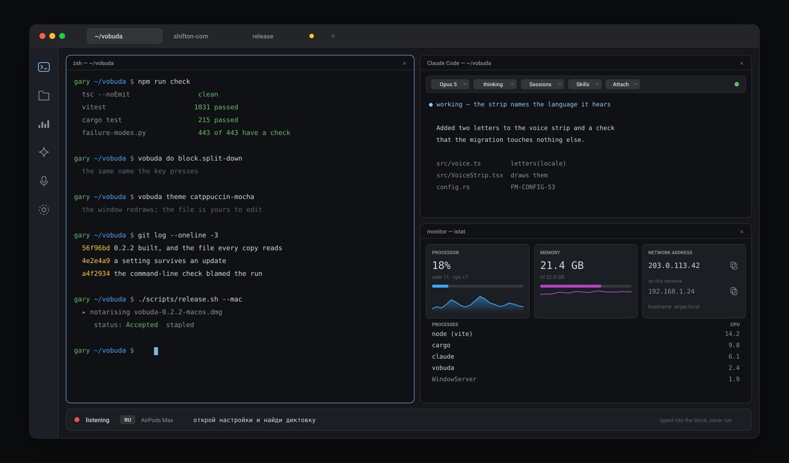
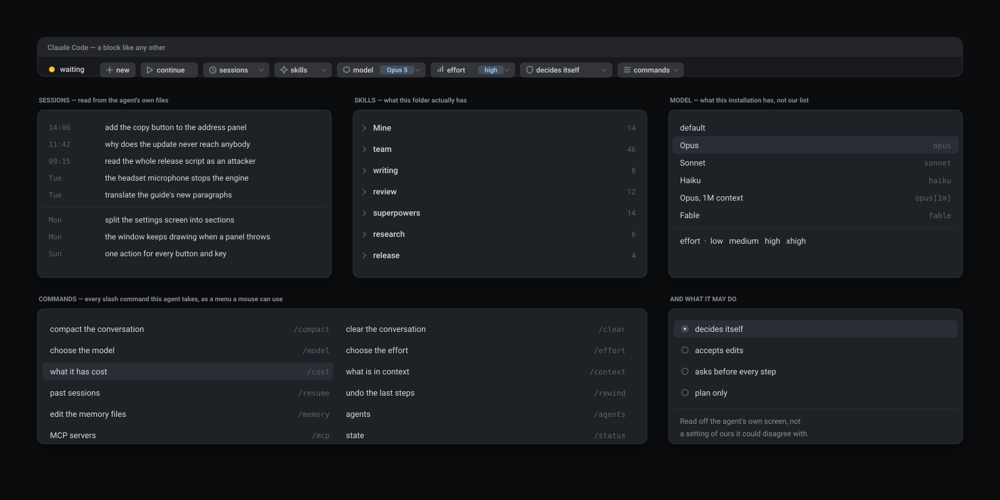
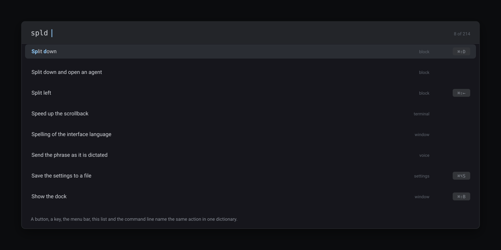
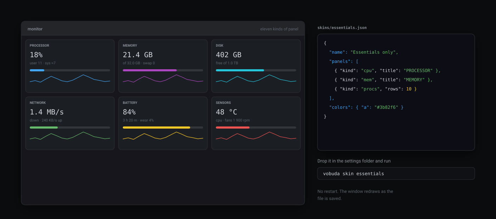
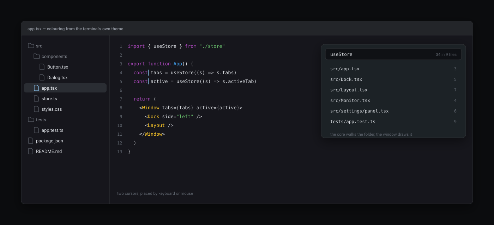
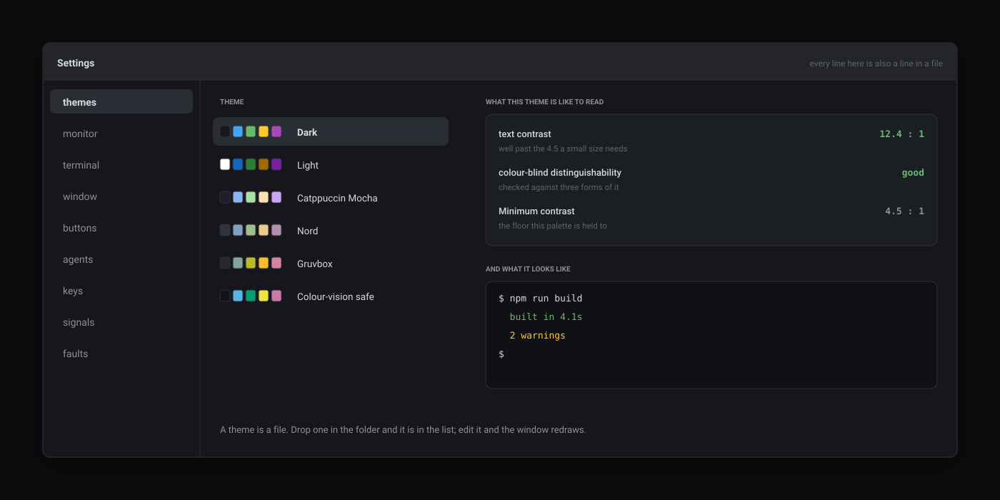

<p align="center">
  <picture>
    <source media="(prefers-color-scheme: dark)" srcset="assets/hero.svg">
    <source media="(prefers-color-scheme: light)" srcset="assets/hero-light.svg">
    
  </picture>
</p>

<h1 align="center">vobuda</h1>

<p align="center">
  <b>A terminal that keeps every setting as a file you can read —<br/>
  and treats a running AI agent as part of the window, not as text scrolling past.</b>
</p>

<p align="center">
  <a href="https://vobuda.com"></a>
  <a href="CHANGELOG.md"></a>
  <a href="LICENSE"></a>
</p>

<p align="center">
  
  
  
  
  
  
</p>

---

```bash
curl -fsSL https://vobuda.com/install.sh | sh
```

One line installs it and the same line updates it. No account, no sign-in, no
telemetry, nothing to configure before it works. macOS opens it without a word
— the build is signed with an Apple Developer ID and notarised.

## Why this exists

Terminals are either fast and bare, or comfortable and closed. The fast ones
keep their configuration in files you own and stop at the shell. The
comfortable ones add panels, accounts and a cloud, and take the files away.

Neither of them noticed that the thing sitting in the terminal all day is now
an AI agent, and that a terminal is the wrong shape for one: an agent has a
model, an effort level, a permission mode, a session history and a state — and
all of it arrives as text scrolling past, invisible the moment it scrolls.

vobuda is the third answer. **Everything it knows is a file you can read, and
the agent is a first-class citizen of the window.** Around those two decisions
it also does what people normally open three more programs for — a system
monitor, an editor, a browser panel — because a block is a block, and once the
window knows how to hold one it can hold any of them.

---

## What it does that others do not

### The agent is part of the window

Start Claude Code, Codex or a local model in a block and a **control bar**
appears above it. Everything the agent knows about itself is in the window —
not in a stream of text that is gone the moment it scrolls.

<p align="center">
  <picture>
    <source media="(prefers-color-scheme: dark)" srcset="assets/agent.svg">
    <source media="(prefers-color-scheme: light)" srcset="assets/agent-light.svg">
    
  </picture>
</p>

**Every slash command, as a menu a mouse can use.** `/compact`, `/clear`,
`/model`, `/effort`, `/cost`, `/context`, `/resume`, `/rewind`, `/memory`,
`/agents`, `/mcp`, `/status` — read from the installation in front of you and
listed with what each one does, in your language. An agent draws its own menus
with arrow keys, where a mouse cannot reach them at all; these are ordinary
drop-downs, drawn by us, over the agent that is running.

**Every skill this folder actually has**, grouped by where it comes from and
counted — your own, your team's, whatever a plugin brought. Sixty skills across
six sources is a list you can look through rather than a name you have to
remember.

**Past sessions with their first line and the time**, read from the agent's own
files. "New" starts one, "continue" picks up the last, and any older one opens
by its first sentence — which is how a person actually remembers a
conversation.

**The model this installation has** — default, Opus, Sonnet, Haiku, the
million-token context, whatever is there — never our list of somebody else's
models, which goes stale the day a new one ships. The **effort** beside it
comes from the model in use.

**What it may do without asking** — decide for itself, accept edits, ask before
every step, plan only — is read *off the agent's own screen* and changed by
pressing its own key as many times as it takes. Not a setting of ours that
could quietly disagree with the truth.

Underneath it all is the real Claude Code or Codex, with your skills, your
memory and your permissions. Nothing is reimplemented and nothing is proxied.
An agent is a **JSON description** — recognised by how its process looks — so
adding one takes no code.

**While you were away.** Every time an agent stops, one line is kept: which
block, what it was asked, when it finished, how long it took. Grouped by block,
newest first, with a mark on what you have not seen. The request is read off
the agent's own screen and left empty when it cannot be read — a guess in a
record is worse than a gap.

**Signals.** An agent that finished, or is waiting for permission, pulses a
badge on its tab, plays a sound you chose and posts a notice. It clears on your
first action in the window — a click, a key, a scroll — not on the cursor
merely passing over the badge.

**The night nobody is there for.** The machine is held awake while there is
work. An agent stopped by a usage limit goes back to work by itself when the
limit lifts — with a switch, and a badge in the morning saying what happened
while you slept. Sleep is released the moment the work ends.

### Files go where you drop them — screenshots included

Drag a file out of Finder and onto a block: its path is **typed into the block
you dropped it on**, quoted, ready to run. Several files become several quoted
paths on one line.

Drop a **screenshot or any image onto the block where the agent is running** and
the agent gets the picture — the same road a path takes, which is exactly how
Claude Code and Codex want to be handed an image. Drag straight from the
screenshot thumbnail in the corner of the screen; nothing has to be saved first.

The built-in **files panel** drags the same way, and letting go over nothing is
how you cancel. Clicking a file there offers what can be done with it rather
than guessing.

Going the other way: `Cmd+Shift+X` copies a block's text — asked of the terminal
itself, because with WebGL rendering there is no text in the page to select —
and `Cmd+Shift+P` captures the block as a picture.

### Everything it knows is a file

No database. No account. No hidden state. `~/.config/vobuda` holds readable
JSON, watched while the program runs — **save the file and the window redraws**.

| File | What it holds |
|---|---|
| `settings.json` | theme, look, terminal, shell, window, signals — about ninety settings |
| `themes/*.json` | terminal and window colours — 25 palettes ship, two built for colour blindness |
| `looks/*.json` | the window's shape: corners, shadows, panel colours, transparency — 23 ship |
| `skins/*.json` | which monitor panels are drawn, and how |
| `buttons.json` | the dock: buttons, order, side, shape |
| `agents.json` | how an agent is recognised and what it is offered |
| `keys.json` | every shortcut — and the native macOS menu is built from this same file |
| `workspaces/*.json` | a project as a window: its own tabs, folder, theme and dock |

Built-in themes live inside the binary and the folder overrides them, so an
update brings new colours **without overwriting anything you edited**. Your
settings folder is a git repository if you want it to be. It saves as one
archive and restores on another Mac; a copy can live in iCloud Drive.

### Five ways to the same action, and they are the same action

A button, a key, the menu bar, `Cmd+K`, and the command line all name one
action in one dictionary. Not five implementations — one.

```bash
vobuda state                    # what is in the window: tabs, blocks, panel, theme
vobuda do block.split-down      # any action by name — the same name the key presses
vobuda do "settings.here:themes"
vobuda button files             # press a dock button
vobuda send 'ls -la\n'          # type into the active block
vobuda theme catppuccin-mocha   # theme, look, dock side
vobuda signal done              # badge and sound
vobuda log 20                   # the program's own log
```

This is not a side door for scripts. **The interface tests drive the whole
program through it**, which is the reason it can be trusted — and the reason an
agent can rearrange your window for you and you can read exactly what it did.


<p align="center">
  <picture>
    <source media="(prefers-color-scheme: dark)" srcset="assets/commands.svg">
    <source media="(prefers-color-scheme: light)" srcset="assets/commands-light.svg">
    
  </picture>
</p>

`Cmd+K` opens the same set as a list: type to narrow it — the letters match in
order, so `spld` finds **Split down** — and each line shows its own shortcut, so
this is also where the keys are learnt. A check holds the list to the core's
dictionary in both directions: an action that exists and is not offered there
fails the build.

### Blocks, not just tabs

A window holds tabs, a tab holds blocks, and a block is a terminal, a file
being edited, the files panel, a web page, the system monitor or the settings
screen. They split in any direction with nesting, drag, resize and close by the
same rules — one set for everything, rather than a new set per feature.

- A block **dragged onto another tab lands with its shell still running**:
  same session, different place. The alternative — close it and start again —
  kills the build you were moving it for.
- Sizes are remembered per block, and there is a floor under how narrow one may
  get, because a panel at 200 points is a panel nobody can use.
- Closing a block with something running in it **asks first**, by name.
- Sessions come back: tabs, blocks and their working folders. A session that
  arrived from another machine opens what it can and says what it could not,
  rather than dropping blocks silently.

### A system monitor, with skins

Processor and cores, memory and swap, disks and their traffic, network,
sensors, battery with wear, processes, GPU and the machine's addresses — eleven
kinds of panel, arranged by a **skin file** rather than by a fixed screen. A
skin of five lines makes another:


<p align="center">
  <picture>
    <source media="(prefers-color-scheme: dark)" srcset="assets/monitor.svg">
    <source media="(prefers-color-scheme: light)" srcset="assets/monitor-light.svg">
    
  </picture>
</p>

The numbers are honest about themselves: a value the system estimates rather
than measures is drawn with `≈`, and absent hardware gives an absent value
rather than a zero. The address panel names **the address the internet sees**
first and the one this machine has on its own network below it, each with a
copy button.

### An editor beside the shell

Colouring for **227 kinds of file**, taken from the terminal's own theme, so an
open file looks like it belongs next to the shell. Search across the whole
project, a file opened by typing part of its name, several cursors placed by
keyboard or mouse.


<p align="center">
  <picture>
    <source media="(prefers-color-scheme: dark)" srcset="assets/editor.svg">
    <source media="(prefers-color-scheme: light)" srcset="assets/editor-light.svg">
    
  </picture>
</p>

Nothing is written until `Cmd+S`. A file changed on disk underneath you is not
overwritten. A binary is refused rather than shown as noise. Closing an edited
file asks.

### Dictation, and the answer read back

`Cmd+Shift+V` types what you say into the block. `Cmd+Shift+R` reads the
agent's last answer out loud. Both use the system's own speech, **on your
machine** — on-device recognition is demanded, not preferred, and a language
that would need the network is refused with instructions for installing it
locally instead.

The strip says which language it is listening in, in two letters. A dictated
phrase is **typed and never run**: recognition mishears, and a misheard command
that runs itself is a program that deletes things because a radio was on. Beside
an agent, where a phrase is a message rather than a command, it can be sent by
itself — that is a setting, and it is read at the moment the phrase ends.

### A web page as a block

A page opens as a block like any other, in the layout, in the session, with its
own address bar, bookmarks and home page. Two pages share a column instead of
being squeezed side by side. Where an agent's browser opens is yours to decide.

### 40 languages, and a guide in each

The whole interface, including the macOS menu bar, which the system builds in
the core. Arabic and Hebrew mirror the entire window — except the terminal
itself, where mirroring would make output and paths unreadable.

A translation key is the English string, so an untranslated string falls back to
readable English rather than to a blank or an identifier. Checks require every
dictionary to be complete **and actually translated**, and require every string
the window shows to have a key at all.

The guide — written for someone who does not program for a living — is in all
forty, opened from the Help menu, and a check holds each translation to the
English one by shape.

### Colour you can actually read

The theme picker states the **contrast** of the theme you are choosing and how
distinguishable its colours are to a colour-blind reader.
<p align="center">
  <picture>
    <source media="(prefers-color-scheme: dark)" srcset="assets/settings.svg">
    <source media="(prefers-color-scheme: light)" srcset="assets/settings-light.svg">
    
  </picture>
</p>
 Two palettes are built
for colour vision deficiency, and a test simulates three forms of it before they
ship. A theme that cannot be read is not a theme.

### The small things that decide whether you keep it

- **The right button is ours** everywhere: the block's own menu inside a block,
  the window's outside one. Settings open **over** the work, not instead of it.
- **A quake window**: one global key drops the terminal from the top of the
  screen; the same key hides it and gives focus back to where you were.
- **`vobuda://open?path=…`** opens a tab in that folder — from a Finder action,
  a script, or another app.
- **The dock** goes on any side, folds, and reorders by dragging.
- **A look you make yourself**: corners, shadows, panel colours, transparency,
  saved as your own file with a button.
- **Nothing asks for a restart.** Ever.

---

## What leaves your machine

Almost nothing, and each of these is worth naming plainly.

| | |
|---|---|
| **Your speech** | recognised on the machine; a language that would need the network is refused, not quietly sent |
| **Your files, settings and history** | never leave. There is no account, no sync, no server of ours |
| **Faults** | recorded where they happen, scrubbed before they are written, and **sent nowhere until you turn it on** |
| **Once a day** | one request asking whether there is a newer version |
| **The address panel** | while it is on screen, one request every ten minutes asking what address the internet sees |

The last two carry nothing about you or the machine. There is no analytics, no
identifier, no usage report — not as a setting you can turn off, but as code
that does not exist.

## How it is built, and why that shows

Every fault the program has ever had is written down with an id, and **a check
names that id** — 443 of them today, and a script refuses a contract nobody
checks. More than 1,400 automated checks run before anything ships, and the
interface ones drive the program through its own command line rather than
through a private hook.

Other guards keep the documents honest: one counts the numbers in them against
the repository, one reddens when the program changes and the documents do not,
one holds forty translations of the guide to the English one by shape, and one
insists every action is pressed by a check somewhere.

The point is not the numbers. It is that when something breaks on your machine,
the fix comes with the check that stops it coming back.

## At a glance

| | |
|---|---|
| **Platform** | macOS 10.15+ (Apple Silicon and Intel, one universal build). Linux and Windows are next |
| **Price** | free, for personal and commercial work alike |
| **Account** | none |
| **Built on** | Rust · Tauri 2 · React 19 · xterm.js with WebGL · Vite |
| **Settings** | readable JSON in `~/.config/vobuda`, hot-reloaded |
| **Interface** | 40 languages, RTL included |
| **Themes** | 25 terminal palettes · 23 window looks · monitor skins of your own |
| **Install** | one line, no administrator rights |
| **Signature** | Apple Developer ID, notarised and stapled |
| **Source** | not published — see the licence |

## Versions

**[CHANGELOG.md](CHANGELOG.md)** — every version and what it added.

The program looks for a new one once a day and says so in a single strip; there
is also **Check for updates** in its own menu. Updating is the line at the top
of this page.

## Getting help

The guide lives inside the program, in your language: **Help → How to use
vobuda**. Questions, bugs and requests are welcome in
[Issues](../../issues).

## Who makes it

vobuda is built by **Shifton Inc** — the team behind
[shifton.com](https://shifton.com), shift management software used in dozens of
countries, and [rolchat.com](https://rolchat.com), its own CRM and telephony.
The terminal came out of that work: a small team that lives in agents and
terminals all day, building the one it wanted.

## Licence

**Free of charge, and closed.** The program costs nothing — for your work and
your business alike — and its source is not published. What is handed out is
the build.

What the licence does not allow is handing the program on: distributing a copy,
selling it, offering it as a service, taking it apart or changing it, using its
name, or removing the parts of the interface that mention the author's other
products. If someone else wants it, point them at
[vobuda.com](https://vobuda.com) — it is free for them too.

See [LICENSE](LICENSE); it is a hundred and fifty lines and written to be read.
If you need something it does not give you, ask — the answer is often yes.

The libraries this is built on are other people's, given away under their own
terms. The full list with every licence text ships inside the program (menu:
**What vobuda is built on**); [THIRD-PARTY.md](THIRD-PARTY.md) is the readable
summary.

---

<p align="center">
  <sub>
    <a href="https://vobuda.com">vobuda.com</a> ·
    built by <a href="https://shifton.com">Shifton Inc</a> —
    makers of <a href="https://shifton.com">shifton.com</a> and
    <a href="https://rolchat.com">rolchat.com</a>
  </sub>
</p>
